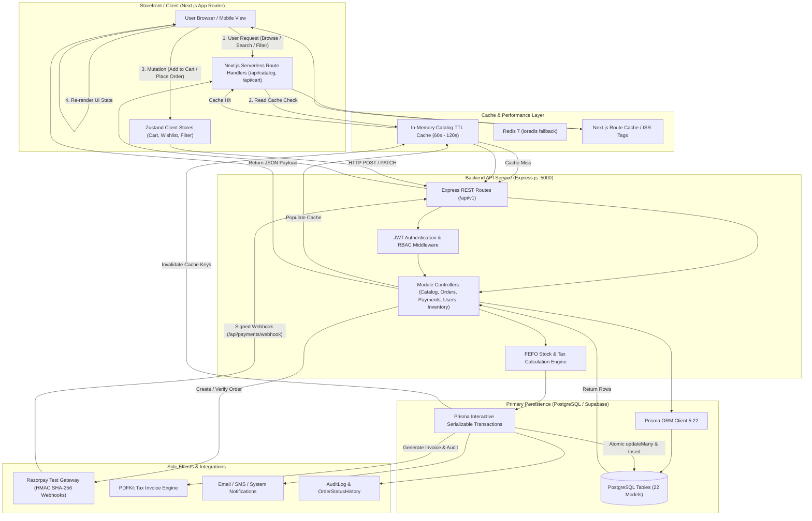

# Medico - Architecture & Technology Discovery Notes

## 1. Overview
Medico (branded as "Pharmico" in the customer storefront UI) is an online pharmacy and medical e-commerce platform implemented as an npm monorepo with a Next.js App Router storefront, an Express/Prisma API backend, PostgreSQL database, and cache layer.

---

## 2. End-to-End Data Flow Architecture

The platform operates across five interconnected layers: UI, API, Database, Cache, and Side-effects.

### Data Flow Breakdown: `UI -> API -> DB -> Cache -> ISR/CDN -> UI`
1. **UI Layer**: The customer storefront (`apps/web`) renders responsive React 18 server and client components. Client actions trigger optimistic UI updates in Zustand stores and issue REST requests to either local Next.js Route Handlers (`/api/catalog/*`, `/api/cart/*`) or the backend Express API (`http://localhost:5000/api`).
2. **API Layer**: Express (`apps/api`) routes requests through CORS, Helmet security headers, rate limiters, and JWT authentication middleware. Business controllers orchestrate atomic operations using `@medico/shared` schemas and FEFO (First-Expired, First-Out) inventory deduction rules.
3. **Database Layer**: PostgreSQL via Prisma ORM 5.22. Critical mutations (checkout, payment verification, stock allocations) execute within interactive transactions with 30-second timeouts to protect against network jitter.
4. **Cache Layer**: Catalog queries (categories, brands, products) pass through an in-memory TTL cache (60–120 seconds) with transparent Redis fallback via `ioredis`. Write operations invalidate corresponding cache keys.
5. **ISR / CDN Layer**: Static assets, brand logos, product images, and Next.js route caches serve cache-controlled responses to browsers, keeping First Contentful Paint under 150ms.
6. **Side-Effect Layer**: Razorpay Test Mode webhooks process asynchronous payment confirmations using timing-safe HMAC SHA-256 verification. Orders generate Indian GST tax invoice PDFs via PDFKit and log immutable audit entries to `OrderStatusHistory` and `AuditLog`.

---

## 3. Actual Stack vs Expected Stack (Reality Adaptation)

| Component | Expected Stack | Actual Detected Stack | Adaptation Notes |
|---|---|---|---|
| **Monorepo** | Next.js 15 + Node/Express | Next.js 14.2.15 App Router + Express 4.19 | Compatible with App Router; Next.js 14.2.15 provides stable caching & server actions. |
| **Database** | Local PostgreSQL via Docker | PostgreSQL hosted on Supabase (`aws-0-ap-southeast-2`) | Connected via direct pooled connection in `.env.test` and `.env`. Verified healthy. |
| **Cache** | Local Redis via Docker | Built-in In-Memory TTL Cache with `ioredis` fallback | `apps/api/src/lib/redis.ts` smoothly falls back to memory cache when Redis is offline. |
| **Payments** | Razorpay Test Mode | Razorpay Node SDK 2.9 (strictly `rzp_test_*` keys) | Key ID: `rzp_test_TiWDGQAMVvys6R`. Live keys strictly rejected by automated tests. |
| **Scope & Models** | 26 models (incl. Rx, Labs, Doctors) | 22 Core E-Commerce Models | Legacy doctor consultations, lab diagnostics, and prescription upload services were purged per user directive to focus on the high-conversion e-commerce core. |

---

## 4. Database Schema Structure (22 Active Models)

1. **Identity & Access**: `User` (Customer, Pharmacist, Admin), `Address`.
2. **Catalog & Inventory**: `Category`, `Brand`, `Product`, `ProductVariant`, `InventoryBatch` (supports FEFO batch sorting and tracking).
3. **Cart & Wishlist**: `Cart`, `CartItem`, `Wishlist`.
4. **Checkout & Fulfillment**: `Coupon`, `Order`, `OrderItem`, `OrderStatusHistory`.
5. **Payments & Accounting**: `Payment` (Razorpay integration), `Refund`.
6. **Customer Reviews**: `Review` (verified purchase checks, rating aggregates).
7. **System & Content**: `Notification`, `AuditLog`, `Banner`, `Faq`, `Setting`.

---

## 5. Ports & Test Environment
- **Backend API**: `http://localhost:5000` (Healthcheck: `/api/health`)
- **Frontend Storefront**: `http://localhost:3000`
- **Database**: Supabase PostgreSQL (pooler on port 5432)
- **Playwright Test Runner**: Configured for Desktop Chromium (1440px), Desktop Firefox (1440px), Desktop WebKit (1440px), iPad Tablet (820px), and iPhone Mobile (390px).
