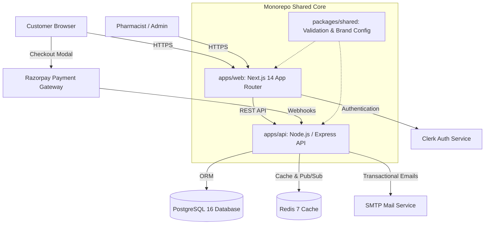

# 💊 Medico (Pharmico) - Digital Pharmacy & Healthcare Platform

[](https://github.com)
[](https://nodejs.org)
[](https://nextjs.org)
[](https://expressjs.com)
[](https://www.prisma.io)
[](#license)

A production-grade, full-stack digital pharmacy and e-commerce platform built for the Indian market, complying with the **Drugs and Cosmetics Act, 1940**, **Drugs and Cosmetics Rules, 1945**, and the **Digital Personal Data Protection (DPDP) Act, 2023**.

The platform features cold-chain logistics awareness, First-Expiry-First-Out (FEFO) batch allocation, prescription upload and verification queues, GST-compliant invoice generation, and Razorpay payment integration.

---

## 🏗️ Architecture Overview



For complete architectural details, see [docs/ARCHITECTURE.md](docs/ARCHITECTURE.md).

---

## 📋 Prerequisites

Ensure the following tools are installed locally before proceeding:

- **Node.js**: `v20.x LTS` (Use `nvm use` to select the version in `.nvmrc`)
- **npm**: `v10.x` or higher
- **PostgreSQL**: `v16.x` (Local service or cloud instance like Supabase / Neon)
- **Redis**: `v7.x` (Local service or Upstash Redis)
- **Docker & Docker Compose** (Optional, for running local containerized services)

---

## ⚡ Quick Start

### 1. Clone & Install Dependencies
```bash
git clone <repository-url>
cd Medico
npm install
```

### 2. Configure Environment Files
Create local environment files for both apps:
```bash
# Copy example files
cp apps/api/.env.example apps/api/.env
cp apps/web/.env.example apps/web/.env
```
Fill in your database URL, Clerk keys, and Razorpay credentials. Refer to [docs/ENVIRONMENT.md](docs/ENVIRONMENT.md) for variable descriptions.

### 3. Initialize the Database
```bash
# Generate Prisma Client
npm run db:generate

# Apply database migrations
npm run db:migrate

# Seed the master catalog (categories, products, batches, staff accounts)
npm run db:seed
```

### 4. Start Development Servers
```bash
# Runs both the Express API (port 5000) and Next.js Storefront (port 3000) concurrently
npm run dev
```

- **Storefront**: [http://localhost:3000](http://localhost:3000)
- **REST API**: [http://localhost:5000](http://localhost:5000)
- **API Health Check**: [http://localhost:5000/api/health](http://localhost:5000/api/health)

---

## 🔑 Default Seed Accounts

The base database seed configures the following accounts:

| Role | Email | Password | Access Level |
|---|---|---|---|
| **Admin** | `admin@medico.com` | `Admin@123456` | Full administrative access & analytics |
| **Pharmacist** | `pharmacist@medico.com` | `Pharma@123456` | Prescription verification & FEFO inventory |
| **Customer** | `customer@medico.com` | `Customer@123456` | Standard consumer purchasing |

---

## 🧪 Verification & Testing Suites

The repository contains four dedicated verification suites:

```bash
# 1. Typecheck all workspaces (zero errors)
npm run typecheck

# 2. Lint all workspaces
npm run lint

# 3. Global Invariants Consistency Audit (15 database regulatory checks)
npm run test:consistency

# 4. API Security, IDOR & Concurrency Tests (Vitest)
npm run test:api

# 5. End-to-End Browser Tests (Playwright)
npm run test:e2e
```

---

## 📁 Repository Structure

```
Medico/
├── apps/
│   ├── api/                   # Express REST API backend
│   │   ├── prisma/            # PostgreSQL schema, migrations, and seeds
│   │   ├── src/
│   │   │   ├── modules/       # Auth, Catalog, Cart, Orders, Prescriptions, Admin
│   │   │   ├── lib/           # Prisma, Redis, Razorpay, PDFKit invoice generator
│   │   │   └── index.ts       # Application entry point
│   │   └── Dockerfile         # Multi-stage production container
│   │
│   └── web/                   # Next.js 14 App Router storefront
│       ├── src/
│       │   ├── app/           # Pages, routes, layouts, and metadata
│       │   ├── components/    # Reusable UI components (Header, Footer, CartDrawer)
│       │   └── lib/           # API client, Zustand stores, Supabase helpers
│       └── Dockerfile         # Multi-stage production container
│
├── packages/
│   └── shared/                # Shared Zod schemas, BRAND_CONFIG, and formatters
│
├── docs/                      # Comprehensive technical documentation
│   ├── ARCHITECTURE.md        # System design, data flow, and components
│   ├── ENVIRONMENT.md         # Environment variable dictionary & secret rotation
│   ├── DEPLOYMENT.md          # Step-by-step production deployment guide
│   ├── RUNBOOK.md             # Operations, troubleshooting, and incident response
│   ├── DATABASE.md            # Schema ERD, invariants, and migration guide
│   ├── CONTRIBUTING.md        # Branching, code style, and quality gates
│   ├── CHANGELOG.md           # Release history up to v1.0.0
│   └── THIRD_PARTY_LICENSES.md# Commercial software license compliance audit
│
├── scripts/                   # Production utility scripts
│   ├── consistency-audit.sql  # SQL queries for 15 database integrity invariants
│   ├── run-consistency-audit.mjs # Runner for automated consistency audit
│   └── seed-extensions.mjs    # Extended QA test fixtures
│
├── tests/                     # Automated test suites
│   ├── api/                   # API security, IDOR, webhook, and race tests
│   └── e2e/                   # Playwright end-to-end browser user flows
│
├── docker-compose.yml         # Containerized local development environment
└── package.json               # Monorepo workspaces definition and scripts
```

---

## 🚀 Deployment

The platform is optimized for deployment on modern cloud platforms:

- **Storefront**: [Vercel](https://vercel.com) (Recommended)
- **Backend API**: [Railway](https://railway.app) / [Render](https://render.com) / Docker
- **Database**: [Supabase](https://supabase.com) / AWS RDS PostgreSQL 16
- **Cache**: [Upstash Redis](https://upstash.com) / Redis Cloud

Refer to [docs/DEPLOYMENT.md](docs/DEPLOYMENT.md) for step-by-step production deployment workflows, database migration commands, and zero-downtime rollback procedures.

---

## 📄 License

Proprietary and Confidential. Copyright &copy; 2026 Pharmico Healthcare Private Limited. All rights reserved.
