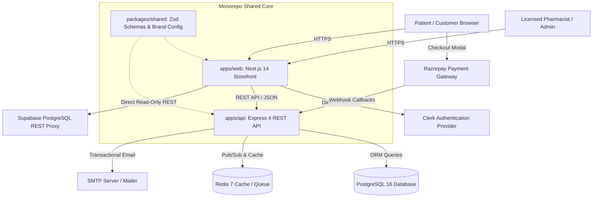

# System Architecture & Technical Specifications

## 1. Executive Summary

**Medico** (storefront branded as **Pharmico**) is an enterprise-grade digital pharmacy, telehealth, and healthcare commerce platform. The platform is engineered to strictly adhere to Indian pharmaceutical regulations—including the **Drugs and Cosmetics Act, 1940**, the **Drugs and Cosmetics Rules, 1945**, and the **Digital Personal Data Protection (DPDP) Act, 2023**—while providing consumer e-commerce performance, sub-50ms catalog browsing, cold-chain logistics traceability, and idempotent payment processing.

---

## 2. High-Level Architecture

The platform operates as a modern monorepo partitioned into three core workspaces:

---

## 3. Workspaces & Core Responsibilities

### 3.1 Storefront & Admin Web (`apps/web`)
- **Framework**: Next.js 14 (App Router) with TypeScript.
- **Styling**: Tailwind CSS with custom healthcare palette (`#0B4A3A` deep forest green, `#10B981` emerald green, `#F5C043` warm amber).
- **State Management**: Zustand for persistent local cart and wishlist storage.
- **Authentication**: Clerk React/Next.js SDK for session handling, OTP login, and user profile management.
- **Key Modules**:
  - Guest and authenticated catalog browsing with live debounced search and category filters.
  - Cart drawer with real-time stock ceiling checks and coupon code redemption.
  - Multi-step checkout with address selection, delivery slot scheduling, and Razorpay modal integration.
  - Order tracking portal with live status progression and GST invoice PDF download.
  - Pharmacist / Admin inspection portal (`/admin`) for prescription verification and FEFO inventory inspection.

### 3.2 Backend REST API (`apps/api`)
- **Runtime**: Node.js 20 LTS + Express 4 + TypeScript.
- **Data Persistence**: Prisma ORM 5 with connection pooling to PostgreSQL.
- **Security & Middleware**:
  - `helmet` for secure HTTP response headers.
  - `cors` with strict origin allowlist.
  - `express-rate-limit` for DDoS and brute-force mitigation on auth endpoints.
  - Role-Based Access Control (RBAC) middleware verifying JWT tokens for `CUSTOMER`, `PHARMACIST`, and `ADMIN`.
- **Core Domain Services**:
  - **Catalog Service**: Category hierarchy, product variants, pricing, and availability.
  - **Inventory Service**: Batch-level First-Expiry-First-Out (FEFO) allocation with race condition prevention.
  - **Order Service**: Order placement, address snapshotting, tax calculations, and status progression.
  - **Payment Service**: Razorpay order initialization, signature verification, and idempotent webhook handlers.
  - **Invoice Service**: PDFKit-powered generation of GST-compliant tax invoices (CGST + SGST breakdown).

### 3.3 Shared Monorepo Package (`packages/shared`)
- **Role**: Single source of truth for types, domain constants, and validation logic.
- **Contents**:
  - `BRAND_CONFIG`: Centralized platform branding (name, legal company name, support contacts, drug license credentials, GSTIN, registered address).
  - `CURRENCY_CONFIG`: Currency code (`INR`), symbol (`₹`), locale (`en-IN`), shipping fee logic, and `formatINR()` monetary formatter.
  - **Domain Enums**: `Role`, `OrderStatus`, `PaymentStatus`, `PaymentMethod`, `AddressType`, `DiscountType`.
  - **Zod Schemas**: Client and server validation schemas for checkout, address creation, cart updates, and catalog search.

---

## 4. Key Technical Decisions & Data Flow

### 4.1 First-Expiry-First-Out (FEFO) Inventory Management
In compliance with pharmaceutical dispensing regulations, medicines cannot be dispensed arbitrarily. The platform implements strict FEFO:
1. Every product variant is linked to one or more `InventoryBatch` records containing `batchNumber`, `expiryDate`, `mrp`, and available `quantity`.
2. When an order is confirmed, the allocation algorithm sorts active non-expired batches by `expiryDate ASC`.
3. Inventory is deducted sequentially from the earliest-expiring batch.
4. Concurrency protection: Stock deductions execute within atomic Prisma transactions with database-level consistency checks, guaranteeing zero overselling under heavy concurrency.

### 4.2 Idempotent Payment Webhooks
Razorpay webhooks notify the platform of asynchronous payment captures:
1. The incoming webhook payload signature (`x-razorpay-signature`) is cryptographically validated using HMAC SHA-256 with the secret key.
2. The webhook handler checks whether the event has already been processed using the unique payment and order IDs.
3. If already processed, the endpoint returns an immediate `200 OK` without duplicating side effects.
4. On first receipt, the order status transitions atomically from `PENDING` to `PAID`, triggering inventory confirmation and dispatching a customer notification.

### 4.3 IDOR (Insecure Direct Object Reference) Protection
All user-specific resources (orders, invoices, prescription uploads, addresses) enforce server-side ownership verification:
- Query predicates always mandate `userId === req.user.id` unless the requesting session holds a verified `ADMIN` or `PHARMACIST` role.
- Attempts to inspect another customer's order ID or download another customer's invoice return a strict `403 Forbidden` response.

---

## 5. Third-Party Service Dependencies

| Service | Provider | Purpose | Fallback Strategy |
|---|---|---|---|
| **Database** | PostgreSQL 16 / Supabase | Relational data persistence & migrations | Read-only replicas / Connection pooler |
| **Caching & Pub/Sub** | Redis 7 / Upstash | Order event publishing and catalog caching | Graceful in-memory fallback if Redis unavailable |
| **Authentication** | Clerk | Customer identity, session cookies, Social SSO | API JWT validation fallback for admin/pharmacist |
| **Payments** | Razorpay | UPI, Cards, Netbanking & Cash on Delivery | Cash on Delivery (COD) fallback toggle |
| **Transactional Email**| SMTP (SES / SendGrid / Mailgun) | Order receipts and status alerts | Non-blocking background worker; failures logged |
