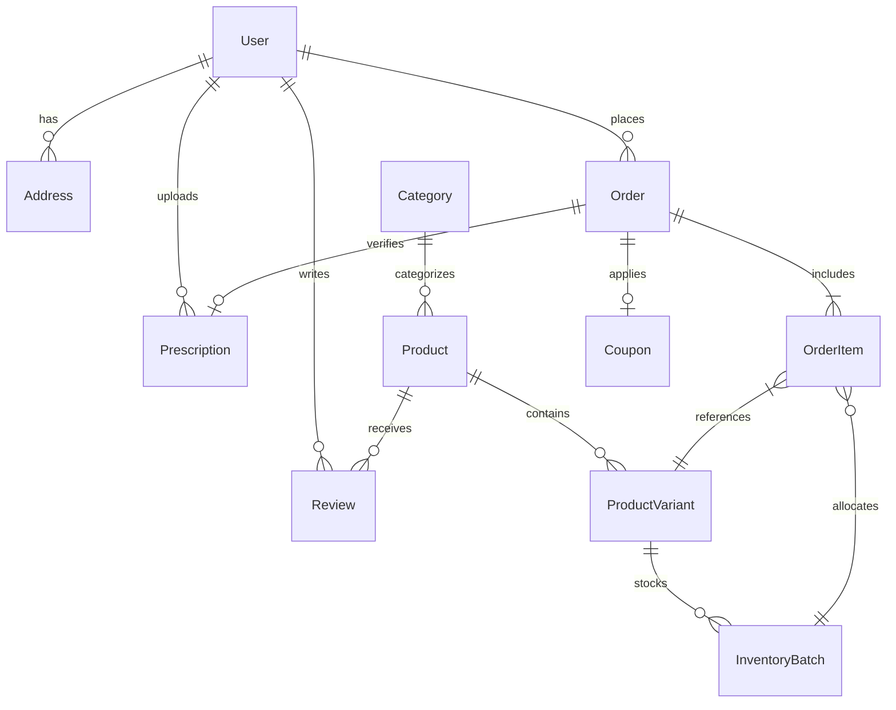

# Database Architecture & Migration Guide

This document describes the relational schema design, entity relationships, integrity invariants, and maintenance procedures for the Medico PostgreSQL database managed via Prisma ORM.

---

## 1. Entity-Relationship Overview



---

## 2. Key Tables & Domain Models

### 2.1 Identity & Access
- **`User`**: Core user entity storing name, email, phone, hashed password, and role (`CUSTOMER`, `PHARMACIST`, `ADMIN`).
- **`Address`**: Customer delivery locations with standard Indian address fields (pincode, city, state, address lines, landmark, isDefault).

### 2.2 Catalog & Inventory Hierarchy
- **`Category`**: Two-level hierarchical classification for medicines and OTC healthcare products.
- **`Product`**: Master medicine or healthcare item definition (generic composition, brand name, prescription required flag, manufacturer details).
- **`ProductVariant`**: Sellable SKU configurations (pack size, strength, form factor e.g. 10 tablets/strip, 100ml syrup).
- **`InventoryBatch`**: Crucial regulatory entity for batch tracking.
  - `batchNumber`: Manufacturer-assigned lot code.
  - `expiryDate`: Expiration timestamp used for First-Expiry-First-Out sorting.
  - `mrp`: Maximum Retail Price printed on packaging.
  - `costPrice`: Sourcing cost.
  - `quantity`: Current available physical units in stock.

### 2.3 Orders & Fulfillment
- **`Order`**: Order header tracking `orderNumber`, `status`, `paymentStatus`, `paymentMethod`, monetary totals (`subtotal`, `taxAmount`, `deliveryFee`, `discountAmount`, `totalAmount`), and customer delivery address snapshot.
- **`OrderItem`**: Line item recording variant ID, batch ID, unit price, quantity, and GST rate applied.
- **`Prescription`**: Uploaded medical prescription files linked to orders, tracked with verification status (`PENDING`, `APPROVED`, `REJECTED`) and reviewing pharmacist ID.
- **`Coupon`**: Promotional discount rules (`PERCENTAGE` vs `FLAT`), minimum cart value, and maximum discount cap.

---

## 3. Core Database Invariants

The database enforces 15 strict invariants audited by `scripts/consistency-audit.sql`:

1. **Non-Negative Stock**: `InventoryBatch.quantity >= 0` always.
2. **Positive Cart Quantities**: `CartItem.quantity > 0` always.
3. **Monetary Precision**: All currency math satisfies `totalAmount = subtotal - discount + deliveryFee`.
4. **GST Integrity**: Indian GST breakdown satisfies `taxAmount = CGST + SGST`.
5. **FEFO Allocation**: No order item may be fulfilled from a batch whose expiry date is in the past.
6. **Address Immutability**: Order delivery addresses are permanently snapshotted into `Order` at checkout to prevent historical order corruption if a user updates their profile address.

---

## 4. Prisma Migration Workflows

### 4.1 Development Schema Changes
When altering `apps/api/prisma/schema.prisma` in local development:
```bash
# 1. Create and apply a migration locally
npx prisma migrate dev --name describe_change --schema=apps/api/prisma/schema.prisma

# 2. Regenerate TypeScript client types
npm run db:generate
```

### 4.2 Production Migration Deployment
In CI/CD and production environments:
```bash
# Applies all pending checked-in SQL migrations without altering migration history
npx prisma migrate deploy --schema=apps/api/prisma/schema.prisma
```
> [!IMPORTANT]
> Never run `prisma migrate dev` or `prisma db push` in production. Always use `prisma migrate deploy` to ensure audited SQL migrations execute deterministically.

---

## 5. Seeding & Test Data

The project provides two levels of data seeding:

1. **Base Catalog Seed (`npm run db:seed`)**:
   - Seeds categories, products, product variants, initial inventory batches, and default administrative accounts (`admin@medico.com`, `pharmacist@medico.com`, `customer@medico.com`).
   - Located at: `apps/api/prisma/seed.ts`.

2. **Extended QA Test Fixtures (`node scripts/seed-extensions.mjs`)**:
   - Seeds customer profiles with active orders, test prescriptions, discount coupons (`WELCOME50`, `HEALTH20`), and realistic test carts.
   - Non-destructive and idempotent.
