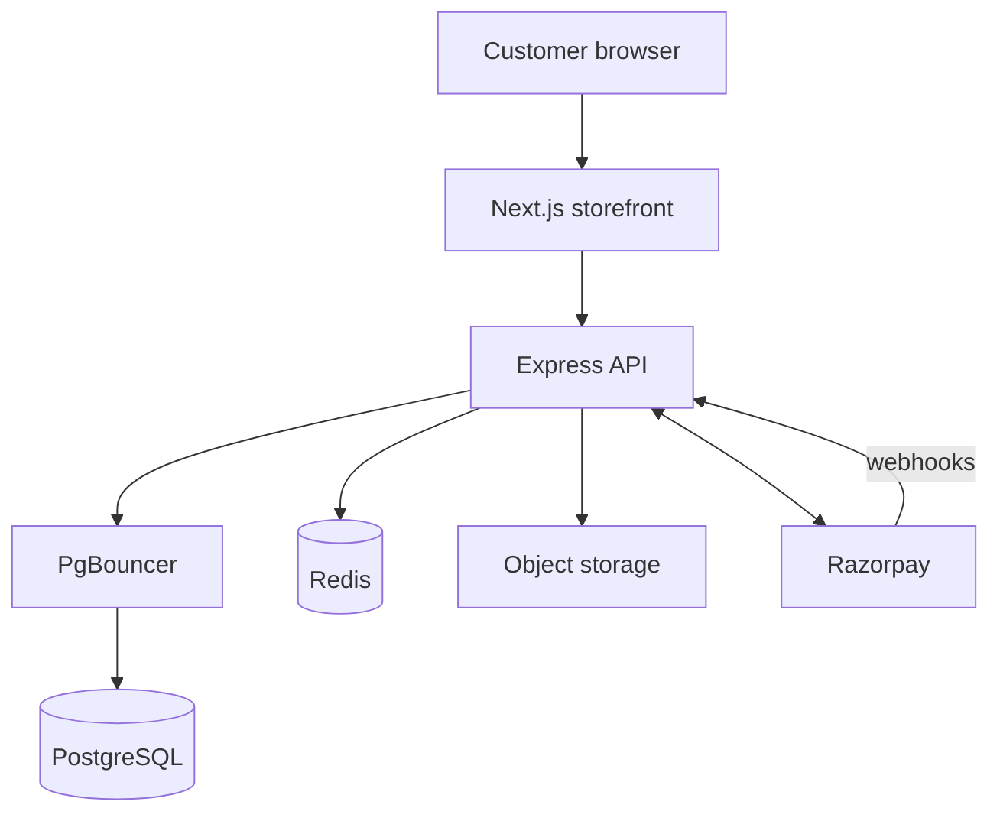
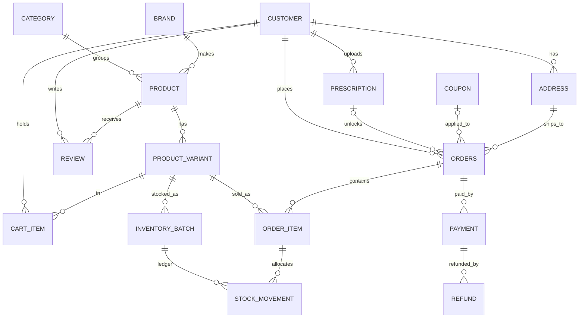

# Medico: Database Architecture

Scope: the Medico customer-facing online pharmacy (storefront and its API). Database: PostgreSQL 16. Cache and queues: Redis. ORM: Prisma.

---

## 1. System overview



| Component | Purpose |
|---|---|
| PostgreSQL | Single source of truth for catalog, stock, orders, payments, prescriptions, customers |
| PgBouncer | Connection pooling (transaction mode) |
| Redis | Cart/session cache, OTP, rate limits, stock-reservation timeouts, job queues (BullMQ) |
| Object storage (Cloudinary/S3) | Product images, prescription files, invoice PDFs. Only the object key is stored in the DB |
| Razorpay | Payments and refunds. DB stores Razorpay ids and statuses, never card data |

---

## 2. Conventions

- Table and column names: `snake_case`, singular table names (`orders` is plural because `order` is a reserved word).
- Primary keys: `uuid` (prefer UUIDv7 for index locality).
- Timestamps: `timestamptz`, stored in UTC, shown in IST in the UI. Columns: `created_at`, `updated_at`, `deleted_at` (soft delete).
- Money: `bigint` in paise. Never `float` or `numeric` for amounts. GST rate in basis points (`gst_bps`, 1200 = 12%).
- Enums: Postgres enums or `text` with CHECK. Keep values identical to the shared TypeScript enums.
- Foreign keys: always declared. Default `ON DELETE RESTRICT`. Use `CASCADE` only for pure child rows (cart items, wishlist items).
- Soft delete: customers and products use `deleted_at`. Never hard-delete rows referenced by orders.

---

## 3. Entity relationship diagram



---

## 4. Table dictionary

### 4.1 Customers

| Table | Key columns |
|---|---|
| `customer` | id, name, email (unique), phone (unique), password_hash (nullable for OTP-only), email_verified_at, phone_verified_at, deleted_at |
| `address` | id, customer_id, name, phone, line1, line2, city, state, pincode, is_default, deleted_at |
| `family_member` | id, customer_id, name, relation, dob (for prescriptions) |
| `refresh_token` | id, customer_id, token_hash, expires_at, revoked_at, replaced_by (rotation and reuse detection) |
| `otp_challenge` | id, target, code_hash, purpose, attempts, expires_at, consumed_at |

### 4.2 Catalog

| Table | Key columns |
|---|---|
| `category` | id, parent_id, name, slug (unique), image_key, sort_order, is_active |
| `brand` | id, name, slug (unique), logo_key |
| `product` | id, category_id, brand_id, name, slug (unique), salt_composition, manufacturer, rx_required, rx_schedule (OTC/H/H1/X), description, uses, side_effects, dosage, storage, status (DRAFT/ACTIVE/ARCHIVED), hsn_code, deleted_at |
| `product_variant` | id, product_id, sku (unique), barcode, pack_label, mrp_paise, price_paise, gst_bps, max_qty_per_order, is_active |
| `product_image` | id, product_id, object_key, alt, sort_order, is_primary |
| `product_substitute` | product_id, substitute_id (same-salt alternatives) |
| `review` | id, customer_id, product_id, order_id, rating, body, status (PENDING/APPROVED/REJECTED). Unique (customer_id, product_id) |
| `wishlist_item` | customer_id, product_id (composite PK) |

### 4.3 Inventory

| Table | Key columns |
|---|---|
| `inventory_batch` | id, variant_id, batch_no, mfg_date, expiry_date, qty_on_hand, qty_reserved, purchase_price_paise. Unique (variant_id, batch_no) |
| `stock_movement` | id, batch_id, order_item_id (nullable), qty_delta, reason (SALE/RESERVE/RELEASE/RETURN/ADJUST/WRITE_OFF), created_at. Append-only |
| `stock_reservation` | id, order_id, batch_id, qty, expires_at, released_at (released by a timeout job after 15 minutes) |

### 4.4 Cart and orders

| Table | Key columns |
|---|---|
| `cart_item` | id, customer_id, variant_id, qty. Unique (customer_id, variant_id) |
| `coupon` | id, code (unique), type (PERCENT/FLAT), value, min_cart_paise, max_discount_paise, max_uses, used_count, per_user_limit, valid_from, valid_to, is_active |
| `orders` | id, order_no (unique), customer_id, address_id, address_snapshot (jsonb), prescription_id, coupon_id, status, subtotal_paise, discount_paise, tax_paise, delivery_paise, total_paise, payment_method (ONLINE/COD), slot_start, slot_end, placed_at |
| `order_item` | id, order_id, variant_id, name_snapshot, sku_snapshot, hsn_snapshot, price_paise, mrp_paise, gst_bps, qty, line_total_paise |
| `order_status_history` | id, order_id, from_status, to_status, note, created_at. Append-only |
| `invoice` | id, order_id, invoice_no (unique, sequential), pdf_key, issued_at |

### 4.5 Payments

| Table | Key columns |
|---|---|
| `payment` | id, order_id, rzp_order_id (unique), rzp_payment_id (unique, nullable), amount_paise, currency, method, status (CREATED/AUTHORIZED/CAPTURED/FAILED), failure_reason, captured_at |
| `refund` | id, payment_id, rzp_refund_id (unique), amount_paise, reason, status (PENDING/PROCESSED/FAILED), processed_at |
| `webhook_event` | id, rzp_event_id (unique), event_type, payload (jsonb), received_at, processed_at. Append-only, makes webhooks idempotent |

### 4.6 Prescriptions

| Table | Key columns |
|---|---|
| `prescription` | id, customer_id, family_member_id, file_key, mime_type, status (PENDING/APPROVED/REJECTED/EXPIRED), rejection_reason, reviewed_by (pharmacist id), reviewed_at, valid_until |

### 4.7 Lab tests and consultations

| Table | Key columns |
|---|---|
| `lab_test` | id, name, slug, sample_type, tat_hours, price_paise, is_package |
| `lab_booking` | id, customer_id, lab_test_id, address_id, slot_start, status, payment_id, report_key |
| `doctor` | id, name, specialization, fee_paise, bio, photo_key, is_active |
| `doctor_availability` | id, doctor_id, weekday, start_time, end_time |
| `appointment` | id, customer_id, doctor_id, slot_start, status, payment_id, meeting_url. Unique (doctor_id, slot_start) prevents double booking |

### 4.8 Site content and notifications

| Table | Key columns |
|---|---|
| `banner` | id, title, image_key, link_url, starts_at, ends_at, sort_order |
| `faq` | id, question, answer, sort_order |
| `testimonial` | id, name, city, body, rating, is_published |
| `site_setting` | key (PK), value (jsonb): delivery charge, free-shipping threshold, COD toggle, maintenance mode |
| `serviceable_pincode` | pincode (PK), city, state, is_active, eta_hours |
| `notification` | id, customer_id, channel (EMAIL/SMS), template, payload, status, sent_at |

---

## 5. Integrity rules

### 5.1 Constraints

```sql
ALTER TABLE inventory_batch
  ADD CONSTRAINT batch_qty_valid
  CHECK (qty_on_hand >= 0 AND qty_reserved >= 0 AND qty_reserved <= qty_on_hand);

ALTER TABLE product_variant
  ADD CONSTRAINT variant_price_valid
  CHECK (price_paise >= 0 AND price_paise <= mrp_paise AND gst_bps BETWEEN 0 AND 2800);

ALTER TABLE review
  ADD CONSTRAINT review_rating_range CHECK (rating BETWEEN 1 AND 5);

ALTER TABLE orders
  ADD CONSTRAINT order_total_valid
  CHECK (total_paise = subtotal_paise - discount_paise + tax_paise + delivery_paise);

CREATE UNIQUE INDEX one_default_address
  ON address (customer_id) WHERE is_default AND deleted_at IS NULL;
```

### 5.2 Stock invariants

1. `qty_on_hand` of a batch = opening quantity + sum of its `stock_movement.qty_delta`. Every change writes a ledger row in the same transaction.
2. Stock is never negative, and a batch past `expiry_date` is never allocated.
3. Allocation is earliest-expiry first: order batches by `expiry_date ASC` and lock them with `SELECT ... FOR UPDATE`.
4. Checkout reserves stock inside one transaction. Failed or abandoned payments release the reservation (a timeout job runs after 15 minutes). Cancellation returns stock to the same batch.

Audit query (should return zero rows):

```sql
SELECT b.id
FROM inventory_batch b
LEFT JOIN (SELECT batch_id, SUM(qty_delta) AS moved FROM stock_movement GROUP BY batch_id) m
  ON m.batch_id = b.id
WHERE b.qty_on_hand <> b.opening_qty + COALESCE(m.moved, 0);
```

(Store `opening_qty` on the batch when it is created.)

### 5.3 Order state machine

```
PENDING_PAYMENT -> PENDING_RX -> CONFIRMED -> PACKED -> SHIPPED -> OUT_FOR_DELIVERY -> DELIVERED
Any state before SHIPPED -> CANCELLED
DELIVERED -> RETURN_REQUESTED -> RETURNED -> REFUNDED
```

- Allowed transitions are enforced in the service layer. Each transition writes an `order_status_history` row, and `orders.status` always equals the latest history row.
- Database backstop for the prescription gate:

```sql
CREATE OR REPLACE FUNCTION enforce_rx_gate() RETURNS trigger AS $$
BEGIN
  IF NEW.status IN ('CONFIRMED','PACKED','SHIPPED','OUT_FOR_DELIVERY','DELIVERED')
     AND EXISTS (
       SELECT 1 FROM order_item oi
       JOIN product_variant v ON v.id = oi.variant_id
       JOIN product p ON p.id = v.product_id
       WHERE oi.order_id = NEW.id AND p.rx_required)
     AND NOT EXISTS (
       SELECT 1 FROM prescription rx
       WHERE rx.id = NEW.prescription_id
         AND rx.status = 'APPROVED'
         AND rx.valid_until >= CURRENT_DATE)
  THEN
    RAISE EXCEPTION 'Approved prescription required for order %', NEW.id;
  END IF;
  RETURN NEW;
END $$ LANGUAGE plpgsql;

CREATE TRIGGER orders_rx_gate
  BEFORE UPDATE OF status ON orders
  FOR EACH ROW EXECUTE FUNCTION enforce_rx_gate();
```

### 5.4 Payments

- Order totals, the Razorpay order amount (in paise), and the invoice total must always be equal. The server recomputes the amount from DB prices and never trusts the client.
- `webhook_event.rzp_event_id` is unique, so duplicate or replayed webhooks do nothing the second time.
- A `PAID` order has exactly one captured payment. Retries create new `payment` rows but never a second capture.
- Refunds are idempotent on `rzp_refund_id`, and total refunded can never exceed the captured amount.

### 5.5 Snapshots

`order_item` copies the name, SKU, HSN, price, MRP and GST at purchase time, and `orders.address_snapshot` copies the delivery address. Later catalog or address edits never change past orders or invoices.

---

## 6. Indexes

```sql
CREATE EXTENSION IF NOT EXISTS pg_trgm;

CREATE INDEX product_search_trgm ON product
  USING gin ((name || ' ' || coalesce(salt_composition, '') || ' ' || coalesce(manufacturer, '')) gin_trgm_ops);

CREATE INDEX product_category_status ON product (category_id, status) WHERE deleted_at IS NULL;
CREATE INDEX product_brand_status    ON product (brand_id, status)    WHERE deleted_at IS NULL;
CREATE INDEX variant_product         ON product_variant (product_id);
CREATE INDEX batch_variant_expiry    ON inventory_batch (variant_id, expiry_date);
CREATE INDEX movement_batch          ON stock_movement (batch_id, created_at);
CREATE INDEX orders_customer_created ON orders (customer_id, created_at DESC);
CREATE INDEX orders_status_created   ON orders (status, created_at DESC);
CREATE INDEX payment_order           ON payment (order_id);
CREATE INDEX cart_customer           ON cart_item (customer_id);
CREATE INDEX review_product_status   ON review (product_id, status);
CREATE INDEX rx_customer_status      ON prescription (customer_id, status);
```

Review the top 20 queries with `EXPLAIN (ANALYZE, BUFFERS)` before launch and look for sequential scans and N+1 patterns.

---

## 7. Redis usage

| Key pattern | Use | TTL |
|---|---|---|
| `session:{customerId}` | Session metadata | 30 days |
| `otp:{target}` | Rate limiting and attempts (the code hash lives in the DB) | 10 min |
| `rl:{route}:{ip}` | Rate limit counters | window |
| `cache:product:{slug}` | Product detail cache | 5 min, invalidated on change |
| `cache:home:featured` | Home page lists | 5 min |
| `lock:checkout:{customerId}` | Prevent double-submit | 30 s |
| BullMQ queues | Reservation release, emails, SMS, invoice PDF, cart reminders | n/a |

Redis is a cache only. Losing it must never lose orders or stock. Everything important is in PostgreSQL.

---

## 8. Roles and access

```sql
CREATE ROLE medico_migrator LOGIN PASSWORD '<<from secret manager>>';
CREATE ROLE medico_app      LOGIN PASSWORD '<<from secret manager>>';
CREATE ROLE medico_readonly LOGIN PASSWORD '<<from secret manager>>';

GRANT USAGE ON SCHEMA public TO medico_app, medico_readonly;
GRANT SELECT, INSERT, UPDATE, DELETE ON ALL TABLES IN SCHEMA public TO medico_app;
GRANT USAGE, SELECT ON ALL SEQUENCES IN SCHEMA public TO medico_app;
GRANT SELECT ON ALL TABLES IN SCHEMA public TO medico_readonly;

REVOKE UPDATE, DELETE ON stock_movement, order_status_history, webhook_event FROM medico_app;
```

- The application connects as `medico_app` only. It cannot run DDL, `DROP`, or `TRUNCATE`.
- `medico_migrator` runs migrations in CI/deploy.
- `medico_readonly` is for reporting and support queries.
- Sensitive columns (password hashes, tokens) are never logged. Prescription files are served through short-lived signed URLs, and ownership is checked on every request.

---

## 9. Migrations and environments

- Prisma Migrate is the single source of truth. Raw SQL (CHECKs, triggers, partial indexes, GIN indexes) goes in migration files via `prisma migrate dev --create-only`.
- Use expand-then-contract for breaking changes: add the new column, deploy code that writes both, backfill, switch reads, then drop the old column in a later release.
- Environments: `local` (docker-compose), `staging` (production-like, Razorpay test mode), `production`. Never copy production data to non-production without anonymizing phone, email, address, and prescriptions.
- The seed script is idempotent and creates only fake data.

### 9.1 Development Commands

```bash
# 1. Generate migration without applying
npx prisma migrate dev --create-only --schema=apps/api/prisma/schema.prisma

# 2. Apply migrations locally
npx prisma migrate dev --schema=apps/api/prisma/schema.prisma

# 3. Regenerate Prisma Client
npm run db:generate

# 4. Run database seed
npm run db:seed
```

### 9.2 Production Deployment

```bash
# Applies all pending checked-in SQL migrations deterministically
npx prisma migrate deploy --schema=apps/api/prisma/schema.prisma
```

---

## 10. Backup and recovery

- Daily full backup plus continuous WAL archiving (point-in-time recovery). Retain 30 days.
- Test a restore into a scratch database before launch and then monthly. Record the time it takes (recovery time objective).
- Encrypt backups at rest and keep them in a separate account or region.
- Prescription files and invoice PDFs: enable versioning and lifecycle rules on the bucket.

---

## 11. Consistency checks to run after every release

| ID | Check |
|---|---|
| C1 | Product stock shown in UI = API = sum of non-expired batch quantities |
| C2 | Cart total in UI = API = recomputed from DB prices, discounts, GST, delivery |
| C3 | Order total = sum of order items + tax + delivery - discount = Razorpay amount = invoice total |
| C4 | Every `PAID` order has exactly one captured payment, and no captured payment lacks an order |
| C5 | Order status = latest `order_status_history` row, and history is a valid path |
| C6 | Stock ledger reconciles for every batch (query in 5.2) |
| C7 | Product rating average and count = recomputed from approved reviews |
| C8 | `coupon.used_count` = number of orders that used it |
| C9 | No order with an Rx item is confirmed or later without an approved, unexpired prescription |
| C10 | Exactly one default address per customer who has addresses |
| C11 | Invoice numbers are unique and sequential |

---

## 12. Scaling notes (later, not needed at launch)

- Add a read replica for reports and search-heavy pages.
- Partition `stock_movement`, `webhook_event`, and `notification` by month once they pass tens of millions of rows.
- Move search to Meilisearch or OpenSearch if trigram search becomes a bottleneck.
- Keep queries on hot paths (listing, product page, cart, checkout) under 50 ms at p95 and watch with `pg_stat_statements`.
